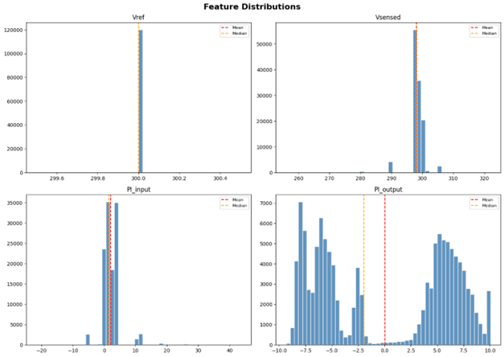
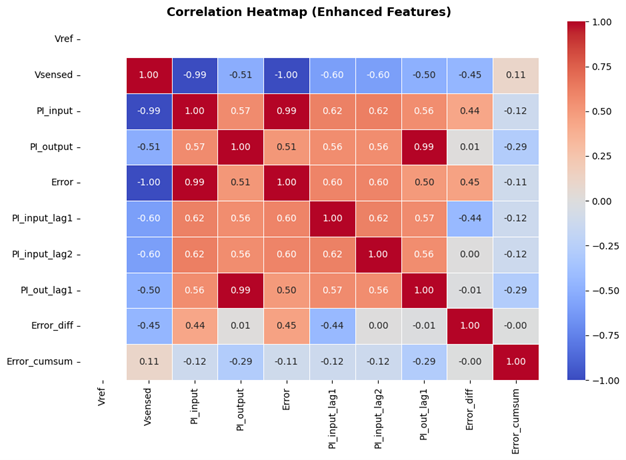
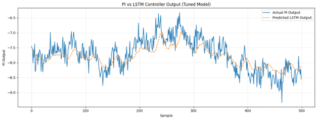
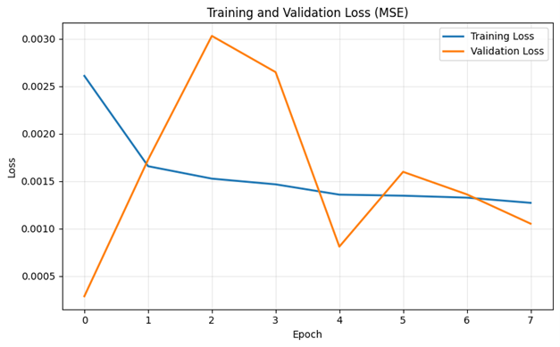
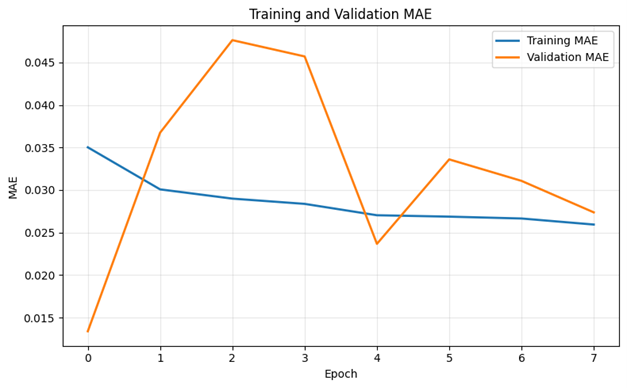
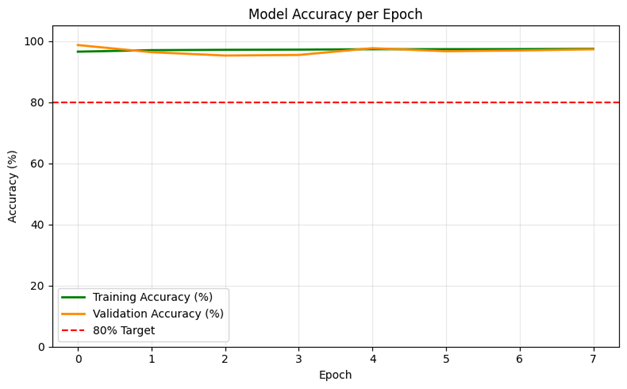
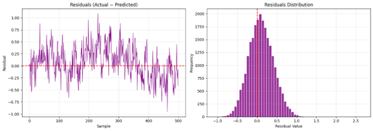
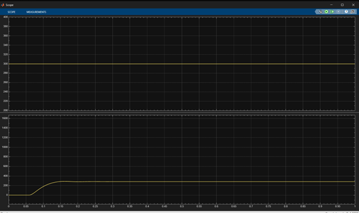

# Bi-LSTM Based AI Controller for PI Controller Replacement

A deep learning based controller using a Bidirectional LSTM neural 
network trained to replicate and replace a conventional PI controller, 
deployed in real-time inside a MATLAB/Simulink model.

## Overview
PI controllers require manual tuning and struggle with nonlinear systems. 
This project trains a Bi-LSTM network on time-series data collected from 
a working PI-controlled system, then reconstructs and deploys the trained 
model directly in Simulink — completely replacing the PI block.

**Workflow:**
```
PI System → Data Collection → Bi-LSTM Training → Weight Extraction → 
MATLAB Reconstruction → Simulink Integration → PI Replacement
```

## Model Architecture

| Layer | Details |
|-------|---------|
| Bidirectional LSTM | 256 units |
| Dropout | 0.2 |
| Bidirectional LSTM | 128 units |
| Dropout | 0.2 |
| LSTM | 64 units |
| Dense | 32 neurons |
| Output Dense | 1 neuron |

- **Total Parameters:** 1,285,441
- **Optimizer:** Adam (lr = 0.0005)
- **Loss Function:** MSE
- **Sequence Length:** 60 time steps

## Dataset

- **Total Samples:** 120,001
- **Source:** Time-series data collected from a working PI-controlled system

**Raw Features:**
- Vref, Vsensed, PI_input, PI_output

**Engineered Features:**
- Error, Error difference, Error cumulative sum
- Lag values of input and output

## Training Results

| Metric | Value |
|--------|-------|
| Accuracy | 94.76% |
| R² Score | 0.9643 |
| RMSE | 0.3288 |
| MAE | 0.2597 |
| MAPE | 5.24% |

- Training and validation loss converged with no significant overfitting
- Residuals centered around zero confirming unbiased prediction
- Predicted output closely matches actual PI controller output

## MATLAB/Simulink Implementation

The trained Bi-LSTM was manually reconstructed in MATLAB without 
using the Deep Learning Toolbox — all gate computations implemented 
from scratch using extracted weights.

**MATLAB function performs:**
1. Feature engineering on incoming signals
2. MinMax scaling using saved scaler parameters
3. Sequence buffering (60 time steps)
4. Full forward pass — BiLSTM Layer 1 → BiLSTM Layer 2 → LSTM → Dense
5. Output rescaling to original signal range

**Files exported from Python:**
- `model_weights_full.mat` — all LSTM and Dense layer weights
- `scaler_params.mat` — MinMax scaling parameters

The PI block in Simulink was removed and replaced with a MATLAB 
Function block running the reconstructed Bi-LSTM in real-time.

## PI vs Bi-LSTM Comparison

| Parameter | PI Controller | Bi-LSTM Controller |
|-----------|--------------|-------------------|
| Manual Tuning | Required | Not Required |
| Adaptability | Low | High |
| Learning Capability | No | Yes |
| Accuracy | Reference | 94.76% |

## Results

### Training Performance








### Simulink Deployment


## Tech Stack
- Python 3 (Google Colab) — training
- TensorFlow / Keras — model
- MATLAB & Simulink — deployment
- NumPy, Pandas, Scikit-learn — data processing

## How to Run

### Training (Python)
1. Open the notebook in Google Colab
2. Upload your PI controller time-series dataset
3. Run all cells to train and export weights

### Deployment (MATLAB/Simulink)
1. Place `model_weights_full.mat` and `scaler_params.mat` in your 
   MATLAB working directory
2. Load weights in MATLAB:
```matlab
load('model_weights_full.mat')
load('scaler_params.mat')
```
3. Open the Simulink model
4. Run simulation and observe LSTM controller output

## Dataset
The dataset was collected from a PI-controlled system simulation.

- **Total Samples:** 120,001
- **Format:** xlxs
- **Features:** Vref, Vsensed, PI_input, PI_output
- **Engineered Features:** Error, error difference, error cumulative sum, lag values

## Author
**Nandini Walia**
B.Tech EEE, Vellore Institute of Technology
[linkedin.com/in/nandiniwalia](https://linkedin.com/in/nandiniwalia)
